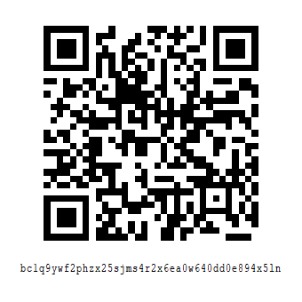

# Bitcoin Node & Mining Support Project

Welcome to my personal project!

I'm a tech enthusiast exploring the world of blockchain and cryptocurrency. I've recently set up a full Bitcoin Core node and created a wallet as part of my journey to better understand the Bitcoin network. As the next step, I'm aiming to build a small-scale Bitcoin mining setup.

This project serves as both a learning platform and a funding request for anyone generous enough to support a fellow blockchain enthusiast. Any contribution, no matter how small will help me purchase Bitcoin mining hardware and deepen my understanding of this revolutionary technology.

## 💡 What This Project Is About

- Running and maintaining a full Bitcoin Core node
- Learning about blockchain mechanics through hands-on experimentation
- Exploring mining hardware and the mining process
- Educating others through open-source documentation (to come)

## 🎯 Current Goal

I'm currently raising funds to purchase entry-level Bitcoin mining hardware (such as a ASIC miner or a low-cost rig). If you'd like to support this project, donations in Bitcoin are highly appreciated.

### Bitcoin Wallet Address for Donations

- **URI**: [bitcoin:BC1Q9YWF2PHZX25SJMS4R2X6EA0W640DD0E894X5LN?label=bitcoin-project](bitcoin:BC1Q9YWF2PHZX25SJMS4R2X6EA0W640DD0E894X5LN?label=bitcoin-project)
- **Bitcoin Address**: bc1q9ywf2phzx25sjms4r2x6ea0w640dd0e894x5ln
- **Bitcoin QR**:

## ❤️ Donor Acknowledgements

A big thank you to all who have supported this project. Your generosity is truly appreciated!

### Donors List

| No. | TX Hash / Name | Amount (BTC) | Message (if any) |
|-----|----------------|--------------|------------------|
| 1   | (example)      | 0.0001 BTC   | "Keep building!" |
| 2   | Anonymous      | 0.0005 BTC   | -                |

> If you prefer to remain anonymous or do not wish your name or transaction to be listed here, feel free to [contact me](mailto:verishare@proton.me) and I’ll promptly remove it.

## 📬 Contact

Feel free to reach out if you:

- Want to collaborate
- Have suggestions or ideas
- Wish to be removed from the donor list

📧 Email: [verishare@proton.me]

---

Thank you for stopping by — and if you've donated, thank you even more for helping me learn and grow in this exciting space!
